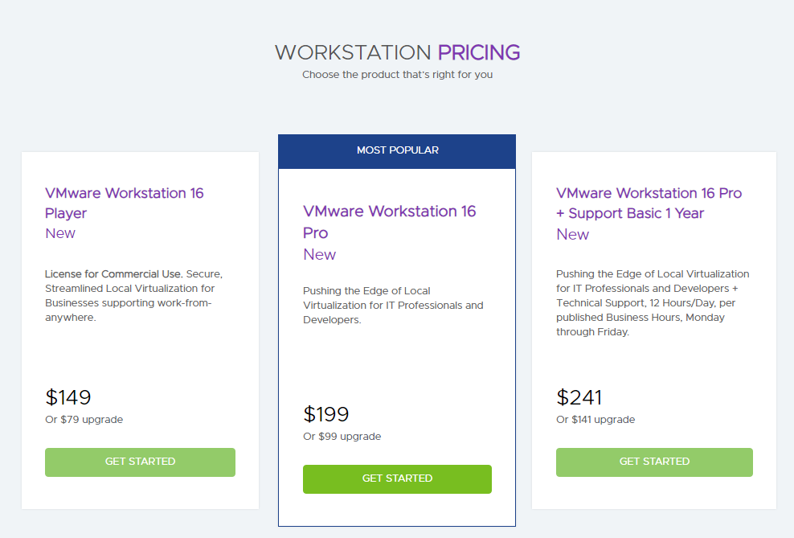
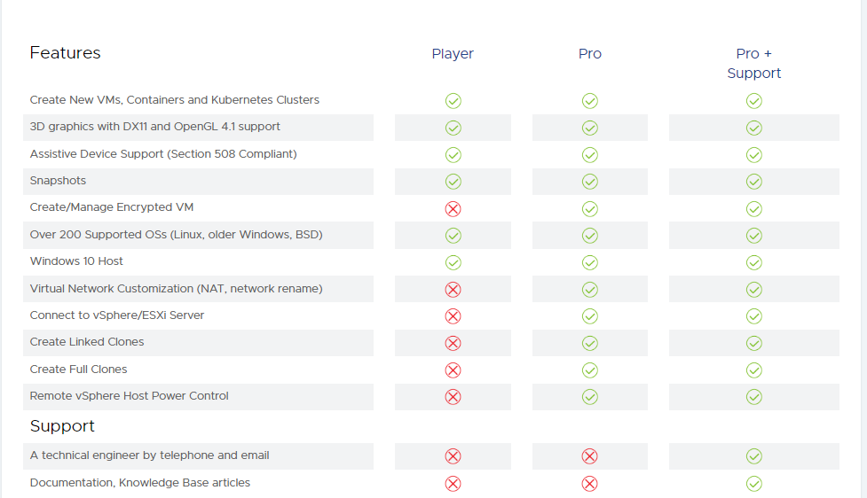
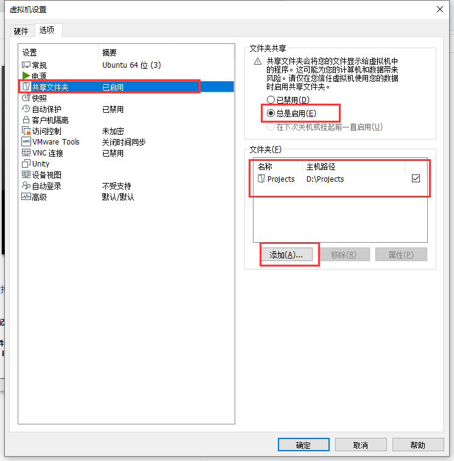

[TOC]

### VMware 用来做什么

> 在一台 PC 上运行多个操作系统

### VMware的价格



> 都是死贵死贵的。

### 版本之间的差别




### 虚拟机和主机共享文件夹

#### 在VMware中启动共享文件夹设置



#### 在Ubuntu中加载共享文件夹

- 查看共享文件夹
```shell
 jthou@ubuntu:~$ vmware-hgfsclient 
 Projects
```

- 加载共享文件夹
```shell
jthou@ubuntu:~$ mkdir ~/share
jthou@ubuntu:~$ vmhgfs-fuse .host:/ ~/share -o allow_other
jthou@ubuntu:~$ cd ~/share/
thou@ubuntu:~/share$ ll
total 17
dr-xr-xr-x 1 root  root  4192 Aug 19 03:19 ./
drwxr-xr-x 9 jthou jthou 4096 Aug 19 03:18 ../
drwxrwxrwx 1 root  root  8192 Aug 19 02:53 Projects/

```
