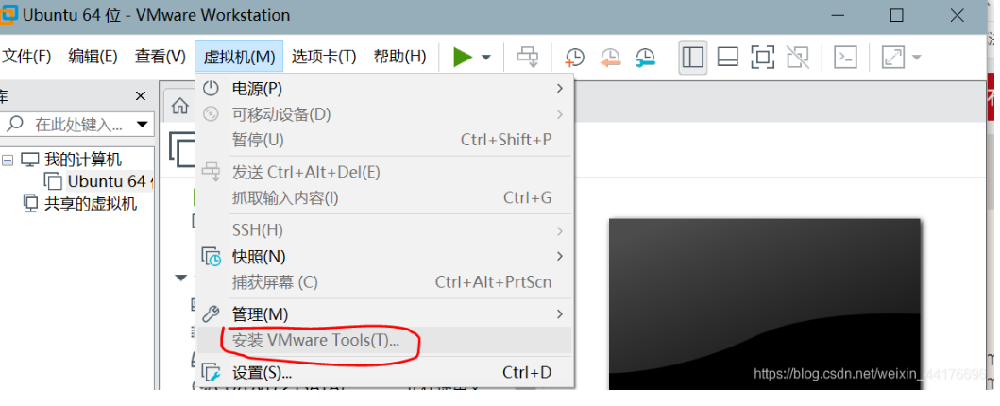
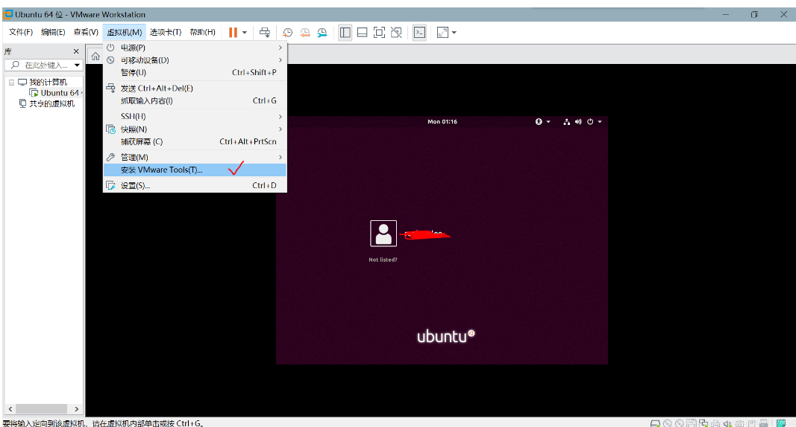
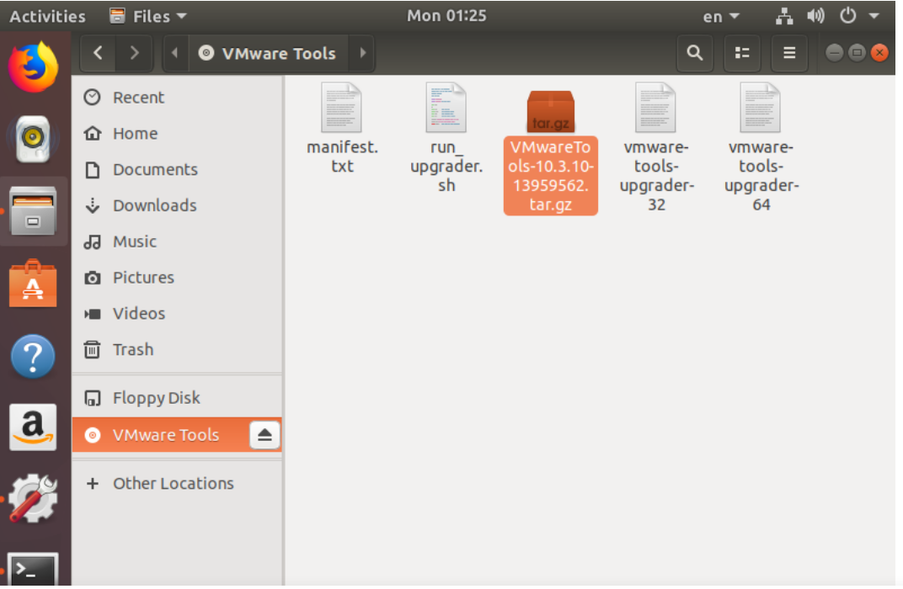

[TOC]


### 虚拟机和主机共享文件夹

#### 在VMware中启动共享文件夹设置


#### 在Ubuntu中加载共享文件夹

- 安装`open-vm-tools`

  ```bash
   jthou@ubuntu:~$ sudo apt install open-vm-tools
  ```

  

- 查看共享文件夹
```shell
 jthou@ubuntu:~$ vmware-hgfsclient 
 Projects
```

- 加载共享文件夹
```shell
jthou@ubuntu:~$ mkdir ~/share
jthou@ubuntu:~$ sudo vmhgfs-fuse .host:/ ~/share -o allow_other
jthou@ubuntu:~$ cd ~/share/
thou@ubuntu:~/share$ ll
total 17
dr-xr-xr-x 1 root  root  4192 Aug 19 03:19 ./
drwxr-xr-x 9 jthou jthou 4096 Aug 19 03:18 ../
drwxrwxrwx 1 root  root  8192 Aug 19 02:53 Projects/

```

### 虚拟机与主机之间复制、粘贴

```bash
jthou@ubuntu:~$ sudo  apt install open-vm-tools
jthou@ubuntu:~$ sudo  apt install open-vm-tools-desktop

```

### 安装VMware Tools

默认是灰的



解决方法：
- 关闭虚拟机
- 将三个盘的物理驱动器改成自动检测


重启虚拟机，点击安装



发现会有一个文件



将改文件解压到home目录下，然后运行 vmware-install.pl
