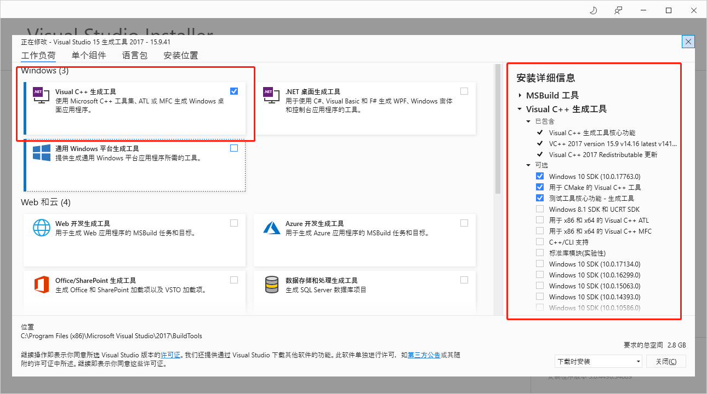

## 开发环境

项目环境配置要考虑到的情况：

- 多项目node版本切换的问题
- 团队成员项目环境一致性的问题
- 依赖库及开发依赖库一致性的问题

### NodeJS 版本切换

开发环境往往需要多种node版本切换，这时候需要用到node的版本管理工具，在Windows下用`nvm`的Windows版本，在Linux下有更多的选择，这里我们选择一个叫做`n`的工具。

#### nvm (Windows)

1. 安装nvm

   > 下载地址：https://github.com/coreybutler/nvm-windows/releases

2. 安装`nodejs`:

   ```cmd
   nvm install 14.18.0
   nvm install last
   nvm install 10.16.
   ```
   > - 设置淘宝镜像：
   >
   >   ```
   >   nvm node_mirror https://npm.taobao.org/mirrors/node/
   >   nvm npm_mirror https://npm.taobao.org/mirrors/npm/ 
   >   ```

3. 查看已经安装的版本

   > nvm list
   ```
       14.18.0
     * 10.16.0 (Currently using 64-bit executable)
   ```

4. 选择node版本

   nvm use 14.18.0
   
   ```
> **已知问题**
> 
> 在普通用户模式下，用nvm use切换可能会失败，报错如下:
> 
> ```
> exit status 1: �ܾ����ʡ�
> ```
> 
> 用管理员身份运行cmd后可以成功切换，之后再用普通用户身份运行node（如果继续用管理员身份执行，可能会导致以后某些文件同样需要管理员权限才能删除或者覆盖）。


#### n (Linux )

1. 安装`npm`

   ```bash
   sudo apt install npm

2. 安装 n

   ```bash
   sudo npm install -g n
   ```
3. 安装`nodejs`

   ```bash
   sudo n install 14.18.0
   sudo n install latest
   ```

4. 查看已经安装的版本

   ```
   n ls
   ```

   ```
   node/14.18.0
   node/16.11.0
   
   ```
5. 选择node版本

   ```
   sudo n
   ```

   ```
       node/14.18.0
     ο node/16.11.0
   
   Use up/down arrow keys to select a version, return key to install, d to delete, q to quit
   
   ```

#### `npx`

`npm` 从5.2版开始，增加了 `npx` 命令，用于调用项目内部安装的模块。如果没有安装，就手动安装一下：

```bash
npm install -g npx
```

`npx` 的主要使用场景：
- 调用项目内部安装的模块
  
  npx 运行的时候，会到node_modules/.bin路径和环境变量$PATH里面，检查命令是否存在。比如，项目内部安装了测试工具 Mocha。
  
  ```bash
  npm install -D mocha
  ```
  
  一般来说，调用 Mocha ，只能在项目脚本和 package.json 的scripts字段里面， 如果想在命令行下调用，必须像下面这样。
  
  ```
  $ node-modules/.bin/mocha --version
  ```
  
  npx 就是想解决这个问题，让项目内部安装的模块用起来更方便，只要像下面这样调用就行了。
  
  ```bash
  $ npx mocha --version
  ```
  
- 避免全局安装模块

  比如：
  
  ```bash
  $ npx create-react-app my-react-app
  ```
  
  上面代码运行时，npx 将create-react-app下载到一个临时目录，使用以后再删除。所以，以后再次执行上面的命令，会重新下载create-react-app。
  
  只要 `npx` 后面的模块无法在本地发现，就会下载同名模块。比如，本地没有安装http-server模块，下面的命令会自动下载该模块，在当前目录启动一个 Web 服务。
  
  ```bash
  $ npx http-server
  ```
  
  如果想让 `npx` 强制使用本地模块，不下载远程模块，可以使用--no-install参数。如果本地不存在该模块，就会报错。
  
  ```bash
  npx --no-install http-server
  ```
  反过来，如果忽略本地的同名模块，强制安装使用远程模块，可以使用--ignore-existing参数。
  
- 使用不同版本的 node

  利用 `npx` 可以下载模块这个特点，可以指定某个版本的 Node 运行脚本。
  
  ```bash
  $ npx node@0.12.8 -v
  ```
  ```
  v0.12.8
  ```
  
  上面命令会使用 0.12.8 版本的 Node 执行脚本。原理是从 `npm` 下载这个版本的 node，使用后再删掉。
  
  某些场景下，这个方法用来切换 Node 版本，要比 nvm 那样的版本管理器方便一些。[^1]

### 安装Visual Studio生成工具

下载地址：

https://visualstudio.microsoft.com/zh-hans/

安装：




配置npm

```bat
npm config set msvs_version 2017
```

### 安装Python

下载地址

https://www.python.org/downloads/windows/

配置npm

```
npm config set python "C:\Python27\python.exe"
```


## 项目配置

### package.json

package.json 文件是项目的清单。 它可以做很多完全互不相关的事情。 例如，它是用于工具的配置中心。 它也是 `npm` 和 `yarn` 存储所有已安装软件包的名称和版本的地方。

对于应用程序，package.json 文件中的内容没有固定的要求。 唯一的要求是必须遵守 JSON 格式，否则，尝试以编程的方式访问其属性的程序则无法读取它。

package.json 中常用的属性分为两种：
- 用于 npmjs.com 的属性
- 用于与代码交互的脚本（npm或其它工具）

#### 用于 npmjs.com 的属性

比如：

```json
  "name": "test-project",
  "version": "1.0.0",
  "description": "A Vue.js project",
  "main": "src/main.js",
  "private": true,
```

有两个属性要特别注意：
- main 设置了应用程序的入口点。
- private 如果设置为 true，则可以防止应用程序/软件包被意外地发布到

#### 用于与代码交互的脚本

- scripts 定义了一组可以运行的 node 脚本。
- dependencies 设置了作为依赖安装的 npm 软件包的列表。
- devDependencies 设置了作为开发依赖安装的 npm 软件包的列表。
- engines 设置了此软件包/应用程序在哪个版本的 Node.js 上运行。
- browserslist 用于告知要支持哪些浏览器（及其版本）。

##### scripts

可以定义一组可以运行的 node 脚本。

示例：

```json
"scripts": {
  "dev": "webpack-dev-server --inline --progress --config build/webpack.dev.conf.js",
  "start": "npm run dev",
  "unit": "jest --config test/unit/jest.conf.js --coverage",
  "test": "npm run unit",
  "lint": "eslint --ext .js,.vue src test/unit",
  "build": "node build/build.js"
}
```
这些脚本是命令行应用程序。 可以通过调用 npm run XXXX 或 yarn XXXX 来运行它们，其中 XXXX 是命令的名称。 例如：npm run dev。

##### dependencies

设置作为依赖安装的 npm 软件包的列表。

当使用 npm 或 yarn 安装软件包时：

```bash
npm install <PACKAGENAME>
yarn add <PACKAGENAME>
```

##### devDependencies

开发依赖安装的 npm 软件包的列表。

当使用 npm 或 yarn 安装软件包时：

```bash
npm install --save-dev <PACKAGENAME>
yarn add --dev <PACKAGENAME>
```

示例：

```bash
"devDependencies": {
  "autoprefixer": "^7.1.2",
  "babel-core": "^6.22.1"
}

```

##### engines

设置此软件包/应用程序要运行的 Node.js 或其他命令的版本。

示例：

```json
"engines": {
  "node": ">= 6.0.0",
  "npm": ">= 3.0.0",
  "yarn": "^0.13.0"
}
```

##### npm软件语义控制

`npm` 设置了一些规则，可用于在 `package.json` 文件中选择要将软件包更新到的版本（当运行 `npm update` 时）。

规则使用了这些符号：

 `^` 、`~` 、`>` 、`>=` 、`<` 、`<=` 、`=` 、`-` 、`||`

这些规则的详情如下：

- `^`: 只会执行不更改最左边非零数字的更新。 如果写入的是 `^0.13.0`，则当运行 `npm update` 时，可以更新到 `0.13.1`、`0.13.2` 等，但不能更新到 `0.14.0` 或更高版本。 如果写入的是 `^1.13.0`，则当运行 `npm update` 时，可以更新到 `1.13.1`、`1.14.0` 等，但不能更新到 `2.0.0` 或更高版本。
- `~`: 如果写入的是 `〜0.13.0`，则当运行 `npm update` 时，会更新到补丁版本：即 `0.13.1` 可以，但 `0.14.0` 不可以。
- `>`: 接受高于指定版本的任何版本。
- `>=`: 接受等于或高于指定版本的任何版本。
- `<=`: 接受等于或低于指定版本的任何版本。
- `<`: 接受低于指定版本的任何版本。
- `=`: 接受确切的版本。
- `-`: 接受一定范围的版本。例如：`2.1.0 - 2.6.2`。
- `||`: 组合集合。例如 `< 2.1 || > 2.6`。


还有其他的规则：

- 无符号: 仅接受指定的特定版本（例如 `1.2.1`）。
- `latest`: 使用可用的最新版本。

示例：

- 0.13.0
  则始终使用确切的版本。

- ~13.0.0
  只更新补丁版本：即 0.13.1 可以，但 0.14.0 不可以。
- ^0.13.0
  更新补丁版本和次版本：即 0.13.1、0.14.0、依此类推。
- 1.0.0 || >=1.1.0 <1.2.0
  使用 1.0.0 或从 1.1.0 开始但低于 1.2.0 的版本。

### npm install

语法：

```
npm install <package>@<version>
```

使用以下命令可以安装 1.2.0 版本：

```
npm install cowsay@1.2.0
```

全局的软件包也可以这样做：

```
npm install -g webpack@4.16.4
```

列出软件包所有的以前的版本：

```
> npm view cowsay versions

[ '1.0.0',
  '1.0.1',
  '1.0.2',
  '1.0.3',
  '1.1.0',
  '1.1.1',
  '1.1.2',
  '1.1.3',
  '1.1.4',
  '1.1.5',
  '1.1.6',
  '1.1.7',
  '1.1.8',
  '1.1.9',
  '1.2.0',
  '1.2.1',
  '1.3.0',
  '1.3.1' ]
```

### package-lock.json

在版本 5 中，npm 引入了 package-lock.json 文件。该文件旨在跟踪被安装的每个软件包的确切版本，以便产品可以以相同的方式被 100％ 复制（即使软件包的维护者更新了软件包）。

package-lock.json 会固化当前安装的每个软件包的版本，当运行 npm install时，npm 会使用这些确切的版本。

## 开发环境方案建议

- 使用node版本管理工具，Windows下使用`nvm`，Linux使用`n`
- 用`nvm`或者`n`，全局安装所需要的NodeJs版本，并根据项目需要做版本切换
- 项目依赖库安装到 dependencies 
- 开发依赖库安装到 devDependencies (-D 或者 --save-dev)
- 提交并管理 package-lock.json文件，保证各个环境下小版本一致。
- 遇到问题时，启动`-v` `--verbose` 选项，查看细节。

### 参考文献

[^1]: [阮一峰 npx 使用教程](https://www.ruanyifeng.com/blog/2019/02/npx.html)

[^2]: [NodeJS 入门教程](http://nodejs.cn/learn)

<<<<<<< HEAD


## VUE

### VUE模块生命周期


### 参考文献

- [Vue生命周期-小白看了都懂的 - 知乎 (zhihu.com)](https://zhuanlan.zhihu.com/p/196771621)
=======
## VUE-CLI

>>>>>>> ce2691ef56ef336e672aebf931c26da6736ac814
