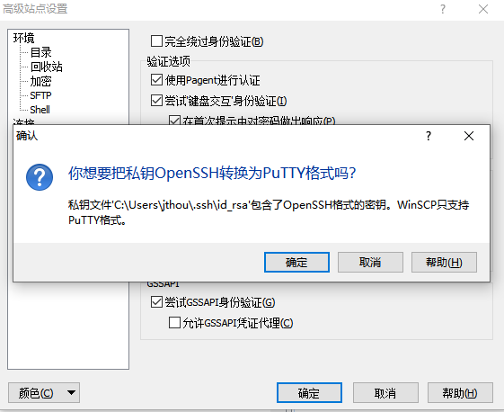
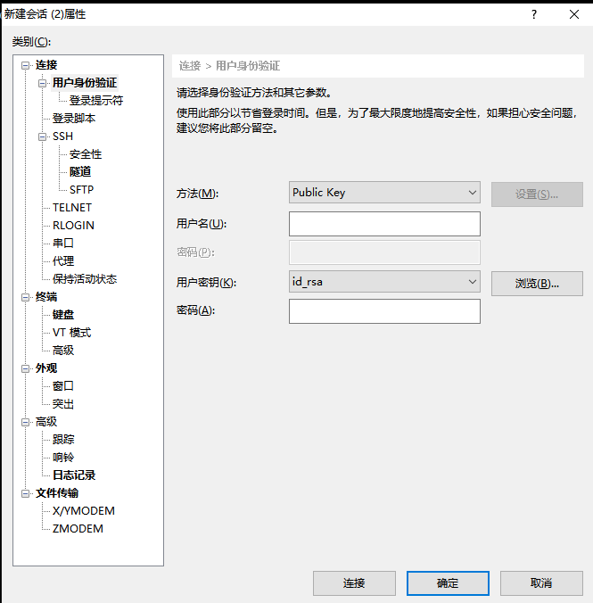

## Linux 服务管理两种方式service和systemctl

Linux 服务管理两种方式service和systemctl

### service命令

service命令其实是去/etc/init.d目录下，去执行相关程序

```bash
# service命令启动redis脚本
service redis start
# 直接启动redis脚本
/etc/init.d/redis start
# 开机自启动
update-rc.d redis defaults
```

### systemctl命令

systemd是Linux系统最新的初始化系统(init),作用是提高系统的启动速度，尽可能启动较少的进程，尽可能更多进程并发启动。
systemd对应的进程管理命令是systemctl

- systemctl命令兼容了service
- systemctl命令管理systemd的资源Unit

systemd的Unit放在目录/usr/lib/systemd/system(Centos)或/etc/systemd/system(Ubuntu)，主要有四种类型文件.mount,.service,.target,.wants

.mount文件定义了一个挂载点，[Mount]节点里配置了What,Where,Type三个数据项

.service文件定义了一个服务，分为[Unit]，[Service]，[Install]三个小节

.target定义了一些基础的组件，供.service文件调用

.wants文件定义了要执行的文件集合，每次执行，.wants文件夹里面的文件都会执行

### 参考

https://www.cnblogs.com/shijingjing07/p/9301590.html


## ssh登录安全性设置

防暴力破解，

- 改ssh端口
- 禁止用户/密码登录
- 只允许证书登录

### 修改ssh端口，禁用22端口

- 备份原sshd配置文件

  ```bash
  cp /etc/ssh/sshd_config /etc/ssh/sshd_config.backup
  ```

  

- 修改sshd_config

  ```bash
  vim /etc/ssh/sshd_config
  ...
  # Port 22
  Port 22334
  ...
  ```

  

- 重启服务

  ```
  service ssh restart
  ```

  

### 云主机添加规则，允许22334端口出入

（略）

### 准备证书

- 生成证书，（可以在服务器上操作，也可以在别的机器上操作，也可以用已有的证书）

  ```
   ssh-keygen
  Generating public/private rsa key pair.
  Enter file in which to save the key (.ssh/id_rsa): 
  Enter passphrase (empty for no passphrase): 
  Enter same passphrase again: 
  Your identification has been saved in id_rsa
  Your public key has been saved in id_rsa.pub
  The key fingerprint is:
  SHA256:YQe1myO6FUdfsmA9oIiw1GOI7JE6X168fvhMTK92h3I youname@yourpc
  The key's randomart image is:
  +---[RSA 3072]----+
  |..+o    ..o      |
  |.=.o+. . o +     |
  |o o..o. + * + .  |
  |o.  . o. = = =   |
  | o o . .S = o    |
  |  . . .+ = .     |
  |     ...+ ..     |
  |      o=+.E .    |
  |      .+++ .     |
  +----[SHA256]-----+
  
  ```

- 将id_rsa.pub拷到服务器上

  ```bash
  ~/.ssh$ cat id_rsa.pub >> authorized_keys
  ```

- 将id_rsa文件拷贝到终端机，**如果证书是在服务器上生成的，一定记得删除**

### 设置WinSCP

配置WinSCP的时候，选中id_rsa文件之后，会提示转成PutTY格式，确定后会生成一个同名的ppk文件，用改文件做为秘钥即可。



### 设置Xshel


